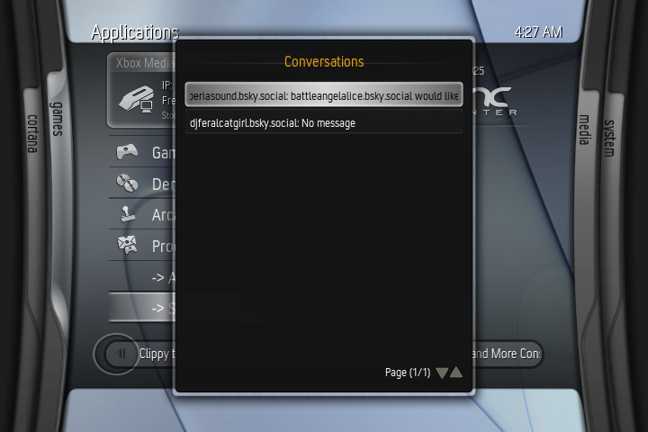
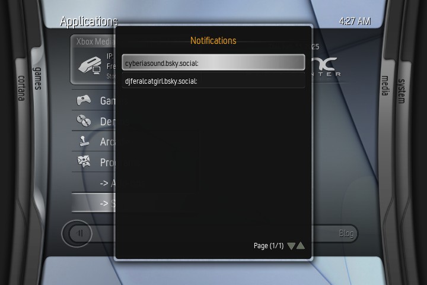

# Cortana Chat (Script Edition) - Bluesky / AT Protocol based instant messaging client for XBMC4Xbox

A functional, decentralized and easy to use instant messenger, right on your Xbox.

## Screenshots:

## Install:
- Before downloading, make sure you're on XBMC 3.6-DEV-r33046 or later, as this most likely requires up to date TLS/SSL libraries!
- Download latest release .zip
- Extract the .zip file and edit "login.txt" to contain your full username (ie; username.bsky.social or username.custom.domain) and app password (do not use your actual password!)
- (Optional) You can use "login.py" in the scripts folder to add/change your login information on any profile!
- Edit "default.py" and modify "TIMEZONE_OFFSET = -5" to your local timezone relative to UTC (-5 is EST) for accurate timestamps
- Copy the Cortana Chat folder to Q:/scripts, but copy your login.txt to your user profile (usually under Q:/UserData/profiles/). You can do this for all the profiles on your system to give them all individual social features!
- (Optional) if using a non-Bluesky AT protocol site, you'll have to modify the BASE_URL and CHAT_URL in default.py to point at that site! Support outside of Bluesky is entirely unsupported, but testing & contributing is encouraged!
- Run the add-on and enjoy!

## Working
- Sending / receiving messages
- Receiving chat/notification toast pop-ups by selecting "Enable Notifications" in settings
- Following/unfollowing/blocking/unblocking users (both manually and via Followers/Following/Mutuals/Blocked menus)
- Inviting other users to games (and accepting invites from other users) via messages and the home feed (via a 360-style Beacon system!)
- Viewng & posting to your home feed
- Viewing following/followers/mutuals sections
- Multi-user logins via XBMC's built-in account feature (each user has their files stored in their own profile directory!)
- MSN-style nudging (once every 30 seconds by default!)

## Not Working
- Liking / Unliking / Sharing / Unsharing posts (possibly not necessary for the scope of Cortana Chat, will definitely implement in xSky though)

## Bugs
- You need to disable notifications (if enabled) before launching a game, or your Xbox may crash! The script currently terminates properly when running a game through the invite system, but needs to be terminated via "Disable Notifications" in the Settings menu to exit cleanly.

## TODO:
- Maybe feed interactions? But also that's more of what xSky is for
- Add timestamps to messages
- Add enable/disable nudging option to settings
